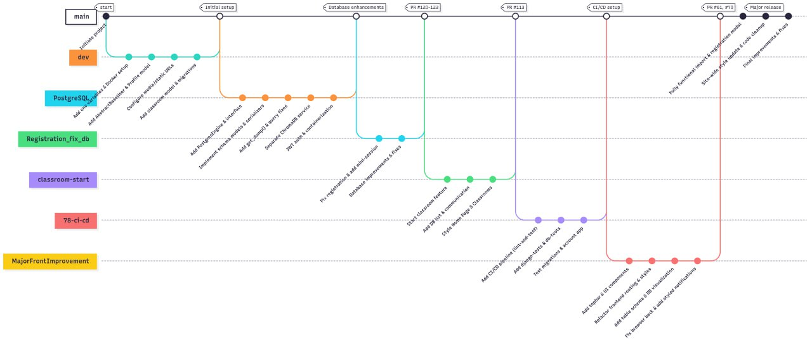

## Development
### Kanban board
[The board ](https://github.com/orgs/S25-SWP-Team46/projects/1/views/3) shows the current iteration.

---  
### Git workflow

We use a simplified workflow inspired by GitHub Flow:

- All work happens in separate branches created from `main`.
- Branch names are chosen freely (`front`, `back`, `db`, etc.).
- Issues are created using templates:  
  [`.github/ISSUE_TEMPLATE/`](../.github/ISSUE_TEMPLATE):  
	- [User Story  ](https://github.com/S25-SWP-Team46/DP-fork/blob/main/.github/ISSUE_TEMPLATE/backlog-bug-report.yml)
	- [Bug Report](https://github.com/S25-SWP-Team46/DP-fork/blob/main/.github/ISSUE_TEMPLATE/backlog-user-story.yml)
	- [Technical Task](https://github.com/S25-SWP-Team46/DP-fork/blob/main/.github/ISSUE_TEMPLATE/task.yml)
   
	and labels:  
	- `enhancement` — new functionality 
	- `User Story` — new functionality from the customers view
	- `bug` — defect reports  
	- `wontfix` — suggestions to improvement
	- `release` — end point of some functionality or task
	- `good first issue` - if it is necessary to start do some actions, but PM do not knows which exactly, because of it is not his own area of knowledges  
	Assignment policy:
		The issue author assigns the issue to the developer responsible, or to the team lead if unassigned. Assigns must acknowledge ownership by leaving a comment within 24 hours.
- Commit messages must be clear and reference issues if needed.
- When work is done:
  - Push your branch.
  - Create a Pull Request to `main` using the template: 
  - [.github/PULL_REQUEST_TEMPLATE.md](./.github/PULL_REQUEST_TEMPLATE.md)
  - Request a review.
- Review policy: global merge requests approving by customer's review
- Merge only after approvals and passing tests in `main`.
- Close related issues after merging and delete branch.  
  

---
### Secrets management
The Django secret key, necessary to run Django app and the SSH key, server IP, USER name, necessary to connect the remote server are stored in the security settings of the repository (secrets and variables -> actions) and passed to the docker environment in the deploy.yml script.
