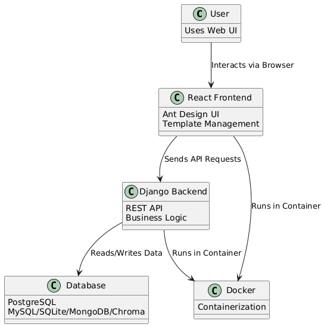

# Database-Playground
[![Contributors][contributors-shield]][contributors-url]
[![Forks][forks-shield]][forks-url]
[![Stargazers][stars-shield]][stars-url]
[![Issues][issues-shield]][issues-url]


This is free web-service for learning and testing different types of databases  
Available on http://89.169.178.180:3000/  
[Demo video](https://disk.yandex.com.am/i/3592sfysVX_rSA)  

## Body
### Project Goal(s) and Description
Project Description:
A web-based platform for designing, saving, and sharing database schema templates. The system features a React + Ant Design frontend for intuitive user interaction and a Django backend for secure API, business logic, and multi-database support. The platform also includes tools for tracking classroom performance and managing educational activities.

Project Goals:
- Enable users to easily create, edit, and manage database templates.
- Support multiple database engines (PostgreSQL, SQLite, MongoDB, Chroma).
- Provide a user-friendly interface for template operations and sharing.
- Ensure secure authentication and template access.
- Allow tracking of student performance, attendance, and participation in classroom environments.

### Built With

* [![React][React.js]][React-url]
* [![Django][Django.com]][Django-url]
* [![PostgreSQL][Postgres.com]][Postgres-url]
* [![Chroma][Chroma.com]][Chroma-url]
* [![MongoDB][MongoDB.com]][MongoDB-url]
* [![FastAPI][FastAPI.com]][FastAPI-url]
* [![MegaParsec][MegaParsec.com]][MegaParsec-url]

<p align="right">(<a href="#readme-top">back to top</a>)</p>

### Project Context Diagram



### Feature Roadmap
- [x] Main page
- [x] Registration
- [x] Query processer
	- [x] Templates support
- [x] Multiple databases support:
	- [x] PostgreSQL
	- [x] ChromaDB
	- [ ] SQLite
	- [ ] MongoDB
- [x] Classrooms space
	- [x] Blog space
	- [x] Tasks space
		- [ ] Feedback system
- [ ] Profile space
	- [ ] Achivements

### Usage instructions / Short user guide

#### EXISTED USER - w/o admin panel
Go to http://89.169.178.180:3000/ and login with 
Login: 
```
Leonid
```
Password: 
```
123456
```
Then go to 
1) Classrooms -> View
2) Templates -> 
	-> Create Template 
	-> Choose DB... (Postgres or Chroma - check Command Tips in the right bottom section) 
	-> write requests and click Run Code 
	-> check DB changes in real time, check execution measuring in the Request Result field. 


---
### NEW USER - admin usage
### Registration usability

---

#### 1. New-User Registration

1. **Open the App**
   - Navigate to the main page of the application.

2. **Sign In or Register**
   - Click **Sign in**.
   - A login modal appears.
     - If you enter unregistered credentials, an error message will display.
   - Click **Register** in the same modal.

3. **Fill Out the Registration Form**
   - **Name** and **Email** must be unique.
   - Email must follow a standard format (e.g., `user@example.com`).
   - Enter your password twice to confirm.
   - Click **Submit**.

4. **Verify Your Account**
   1. Go to **Account** (your name appears in the header).
   2. Click **Log Out**.
   3. Back on the main page, click **Sign in** and log in with your new credentials to confirm.

5. **Confirm in Admin Panel**
   1. Open the Admin Panel at http://89.169.178.180:8000/admin/.
   2. Log in with:
      - **Username:** `admin`
      - **Password:** `admin`
   3. Navigate to **Users** &rarr; verify your newly created user is listed.

---

#### 2. Classroom Setup

> **Note:** Only users with the **TA** role can be assigned as Teacher Assistants.

#### 2.1 Create a Classroom

1. In the Admin Panel, click **Classrooms**.
2. Click **Add Classroom**.
3. Fill in all required fields (e.g., name, description).
4. Click **Save**.

#### 2.2 Assign the TA Role

1. In the Admin Panel, go to **Users**.
2. Select the user you wish to promote.
3. In their profile, set **Role** to **Teacher Assistant**.
4. Click **Save**.

#### 2.3 Enroll Users

1. In the Admin Panel, click **Enrollments**.
2. Click **Add Enrollment**.
3. Complete the form:
   - **User:** Select the student (e.g., yourself).
   - **Classroom:** Choose the class you created.
   - **Rating:** Assign an initial rating or grade.
4. Click **Save**.

#### 2.4 Verify in the App

1. Go to the front-end at http://89.169.178.180:3000/.
2. Navigate to **Classes** (or the specific class page).
3. Refresh or re-select the class—you should see yourself enrolled.

---

With these steps, a new admin can register, create a classroom, assign a TA, and enroll students—validated in both the Admin Panel and the main application.

### Project Installation / Deployment instructions

To deploy the project locally:  
```sh
docker-compose up --build
```
To deploy the project on the server:  
```sh
docker-compose build --build-arg REACT_APP_API_URL=http://your-server-ip:8000  
docker-compose up  
```
## Documentation
### Development

[Development documentation](./CONTRIBUTING.md)


---


### Quality characteristics and quality attribute scenarios

[Quality characteristics and quality attribute scenarios documentation](./docs/quality-assurance/quality-attribute-scenarios.md)


---


### Quality assurance
#### Automated tests

[Automated tests documentation](./docs/quality-assurance/automated-tests.md)

#### User acceptance tests

[User acceptance tests documentation](./docs/quality-assurance/user-acceptance-tests.md)


---


### Build and deployment automation

[Pull request](https://github.com/S25-SWP-Team46/DP-fork/pull/147), where CI/CD can be seen

#### Continuous Integration

[Continuous integration documentation](./docs/automation/continuous-integration.md)

#### Continuous Deployment

[Continuous deployment documentation](./docs/automation/continuous-delivery.md)

### Contributors:

<a href="https://github.com/S25-SWP-Team46/DP-fork/graphs/contributors">
  
</a>

<p align="right">(<a href="#readme-top">back to top</a>)</p>


---


### Architecture

[Architecture documentation](./docs/architecture/architecture.md)


[contributors-shield]: https://img.shields.io/github/contributors/S25-SWP-Team46/DP-fork.svg?style=for-the-badge
[contributors-url]: https://github.com/S25-SWP-Team46/DP-fork/graphs/contributors
[forks-shield]: https://img.shields.io/github/forks/S25-SWP-Team46/DP-fork.svg?style=for-the-badge
[forks-url]: https://github.com/S25-SWP-Team46/DP-fork/forks
[stars-shield]: https://img.shields.io/github/stars/S25-SWP-Team46/DP-fork.svg?style=for-the-badge
[stars-url]: https://github.com/S25-SWP-Team46/DP-fork/stargazers
[issues-shield]: https://img.shields.io/github/issues/S25-SWP-Team46/DP-fork.svg?style=for-the-badge
[issues-url]: https://github.com/S25-SWP-Team46/DP-fork/issues
[React.js]: https://img.shields.io/badge/React-20232A?style=for-the-badge&logo=react&logoColor=61DAFB
[React-url]: https://reactjs.org/
[Django.com]: https://img.shields.io/badge/Django-092E20?style=for-the-badge&logo=django&logoColor=white
[Django-url]: https://www.djangoproject.com/
[Postgres.com]: https://img.shields.io/badge/PostgreSQL-316192?style=for-the-badge&logo=postgresql&logoColor=white
[Postgres-url]: https://www.postgresql.org/
[Chroma.com]: https://img.shields.io/badge/Chroma-4B0082?style=for-the-badge
[Chroma-url]: https://www.trychroma.com/
[MongoDB.com]: https://img.shields.io/badge/MongoDB-4EA94B?style=for-the-badge&logo=mongodb&logoColor=white
[MongoDB-url]: https://www.mongodb.com/
[FastAPI.com]: https://img.shields.io/badge/FastAPI-009688?style=for-the-badge&logo=fastapi&logoColor=white
[FastAPI-url]: https://fastapi.tiangolo.com/
[MegaParsec.com]: https://img.shields.io/badge/MegaParsec-3776AB?style=for-the-badge
[MegaParsec-url]: https://github.com/mrkkrp/megaparsec
