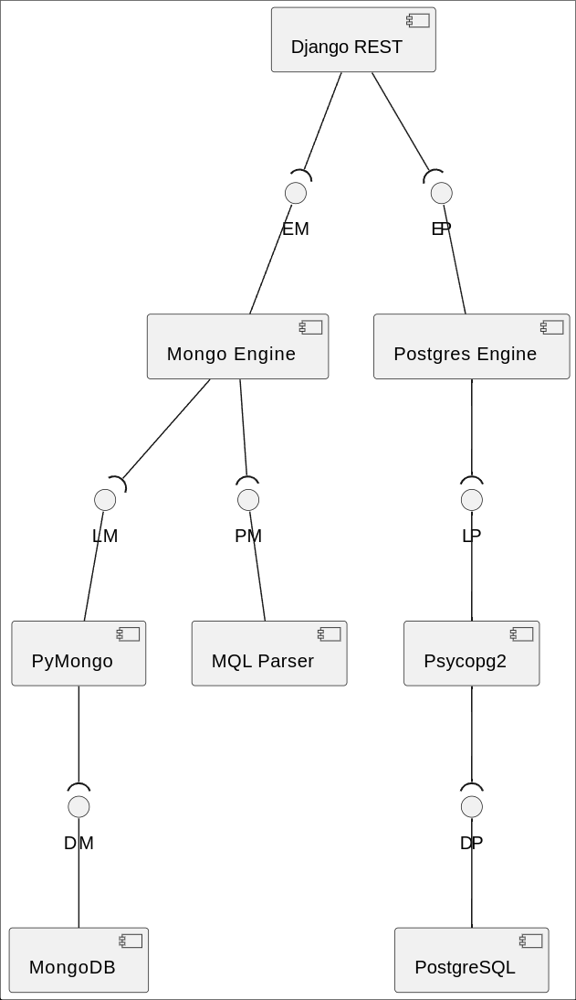
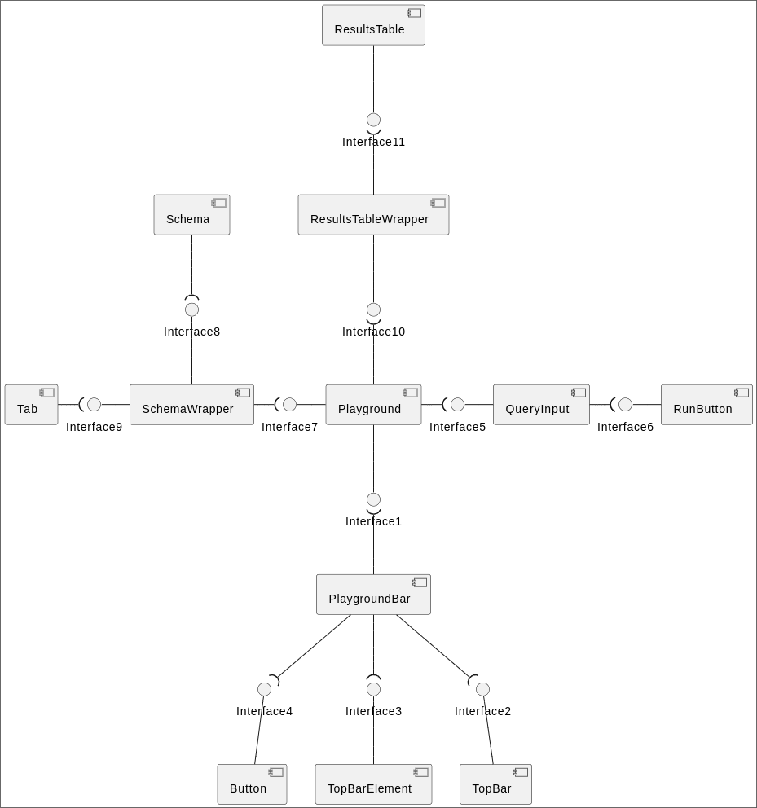
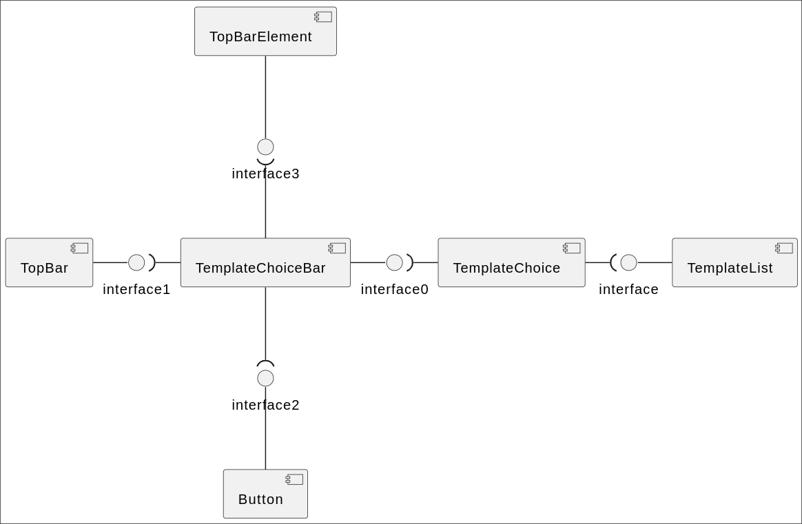
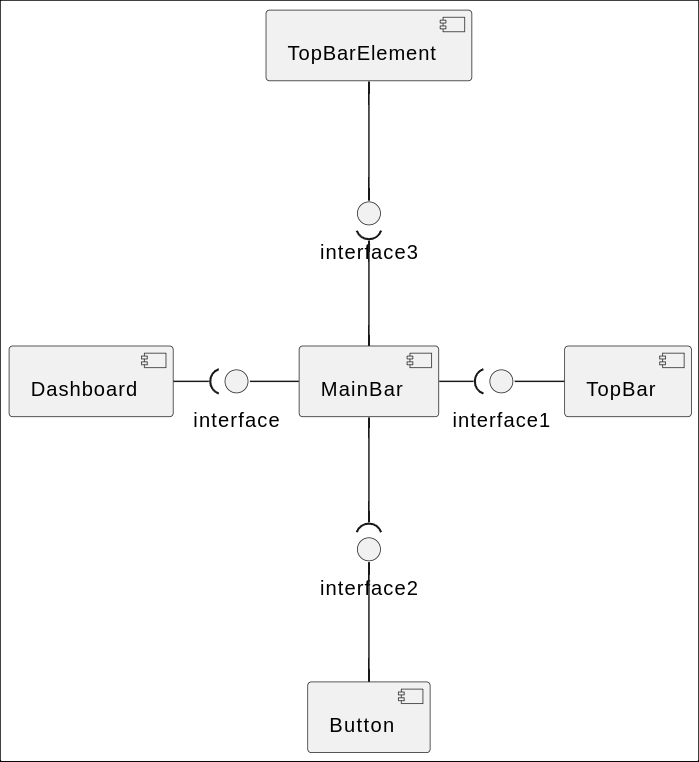
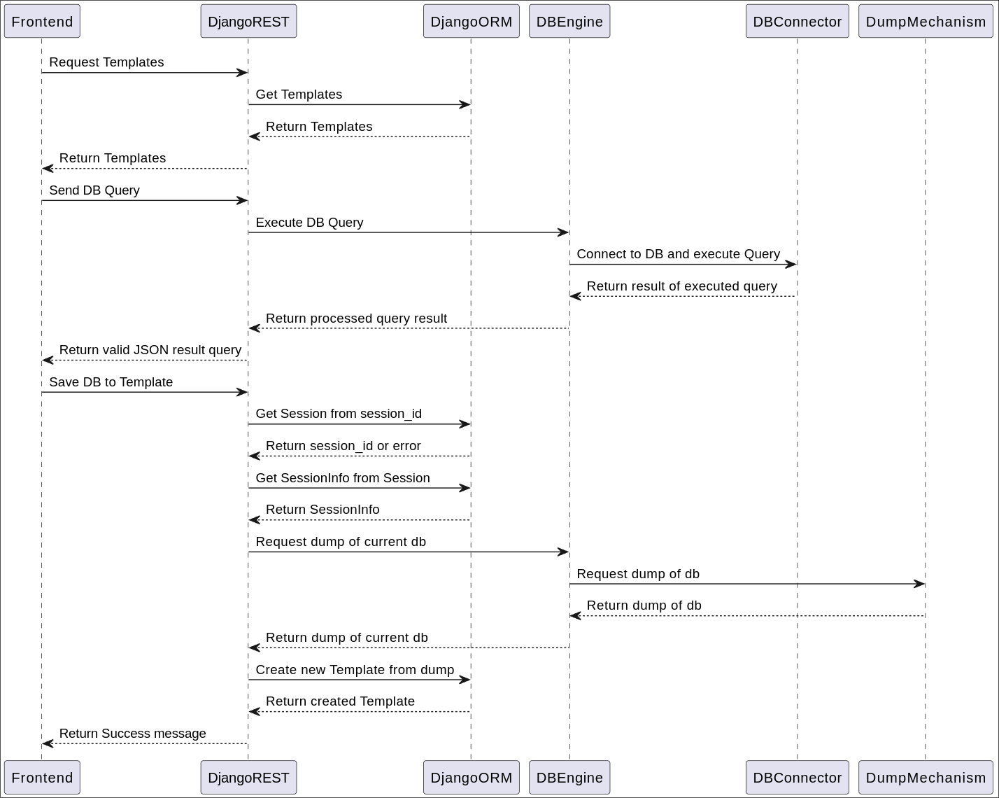
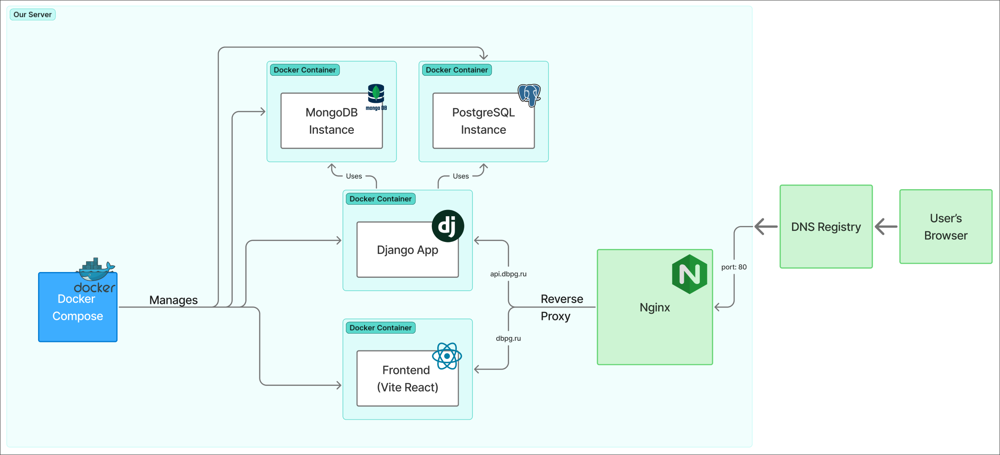

# Database-Playground

## Launch/Access instructions
### You can visit [deployed version](https://dbpg.ru)
### Or you can build the app yourself:

1. Clone the repo:
```sh
$ git clone https://github.com/Delta-Software-Innopolis/Database-Playground
$ cd Database-Playground
```
2. In order for app to run you need `.env` and `db.sqlite3`, you can take sample data from the `deploy` directory:
```sh
$ cp deploy/db.sqlite backend/core/db.sqlite3
$ cp deploy/.env.sample .env
```
3. Run the app via `Docker Compose` (Install it [here](https://docs.docker.com/compose/install/)):
```sh
$ docker compose up --build
```
4. Working version should be available at http://localhost:5173

### Static View
#### Components of backend


#### Components of Frontend:
Our frontend architecture uses many small single responsibility components combined togheter. This ensures modularity and reusability in the application. 
- Playground Page


- Template Choice Page


- Dashboard Page


### Dynamic View
#### Sequence Diagram of Main Backend Workflows


### Deployment View


## Build and deployment
### Continuous Integration
- [backend.yml](https://github.com/Delta-Software-Innopolis/Database-Playground/blob/pre-chroma/.github/workflows/backend.yml):
  - isort - sorting imports for easier readability
  - flake8 - linter for python code
  - pytest (via script) - run unit tests for the app
- [frontend.yml](https://github.com/Delta-Software-Innopolis/Database-Playground/blob/pre-chroma/.github/workflows/frontend.yml):
  - ESLint - linter for JavaScript code
  - Prettier - formatter for JavaScript and CSS
  - Dependency cruiser - Validating frontend code dependencies
- [deploy.yml](https://github.com/Delta-Software-Innopolis/Database-Playground/blob/pre-chroma/.github/workflows/deploy.yml):
  - Github - to fetch the newest version of the code and run this workflow
  - SSH - to connect to the server and deploy
  - Docker Compose - to easily build and run code
  - [All workflow runs](https://github.com/Delta-Software-Innopolis/Database-Playground/actions)

## Architecture
