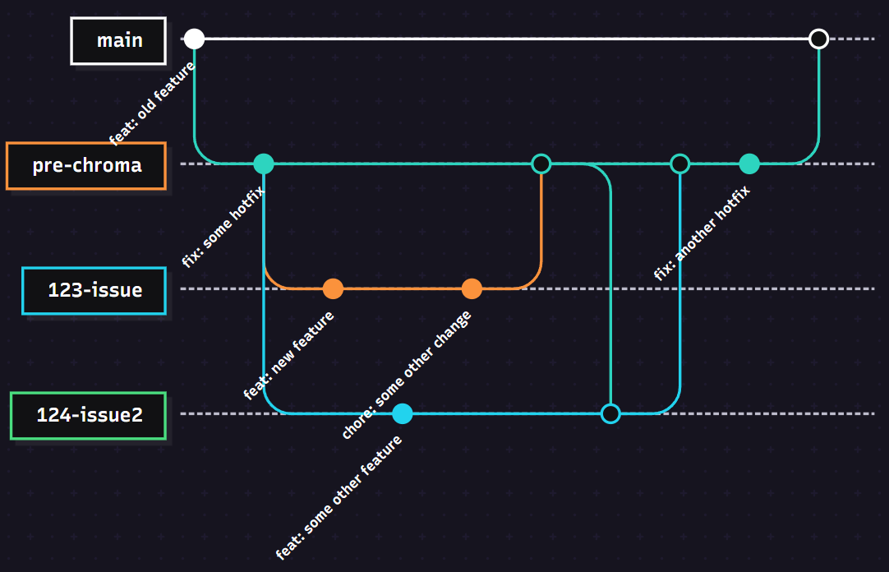

# Database-Playground

## Usage

## Architecture

## Development
This section documents the development policies used in the project.

### Kanban board
We use a **GitHub Projects Kanban board** to track progress:

**[🔗 View our Kanban Board](https://github.com/orgs/Delta-Software-Innopolis/projects/1/views/1)**

#### Entry Criteria

| Column | Entry Criteria |
|--------|----------------|
| Todo | Issues must have a clear description and acceptance criteria. |
| In Progress | Issues must have owner(s) assigned to them and be actively worked on (preferably, in a separate branch).  |
| On Review | Issues must be resolved with a pull request that is being actively reviewed. |
| Done | Issues must be resolved and closed (a pull request is not necessary). |
| Cancelled | Issues must be closed due to being cancelled. |

### Git workflow

We adapted GitHub Flow with slight modifications for our CI/CD pipeline.

#### Rules

**1. Creating issues**

- Use the predefined issue templates:
    - [Bug Report](https://github.com/Delta-Software-Innopolis/Database-Playground/blob/pre-chroma/.github/ISSUE_TEMPLATE/bug_report.md)
    - [Technical Task](https://github.com/Delta-Software-Innopolis/Database-Playground/blob/pre-chroma/.github/ISSUE_TEMPLATE/technical-task.md)
    - [User Story](https://github.com/Delta-Software-Innopolis/Database-Playground/blob/pre-chroma/.github/ISSUE_TEMPLATE/user-story.md)
- Assign labels (e.g., `Bug`, `Feature`, `Frontend`, `Backend`, etc.).

**2. Branching**

- Name branches as:
`<issue number>-<issue name (shortened)>`
    - Example:
    `85-refactor-mongoengine`

- Create new branches from the development branch (currently, `pre-chroma`).

**3. Commit Messages**

Follow Conventional Commits:

```
<type>(<optional scope>): <description>

<optional body>

<optional footer>
```

**4. Pull Requests (PRs)**

- Use the **[PR Template](https://github.com/Delta-Software-Innopolis/Database-Playground/blob/pre-chroma/.github/pull_request_template.md)**.

    - Link to the issue (e.g., Closes #123).

    - Require at least one approval before merging.

- Direct pushes to development branch are allowed for minor fixes/urgent changes.

**5. Merging**

- No enforced squashing: Merge commits are preserved.

- Merged branches are kept (not automatically deleted) to prevent accidental overwrites.

**6. Code Reviews**

- For PRs only:

    - At least one approval required.

    - Reviewers check for code quality and adherence to standards.

**7. Resolving Issues**

- Automatically: Issues linked to PRs via Closes #123 are closed when the PR merges.

- Manually: If pushed directly to the development branch, close the issue after verifying the changes are deployed.

- Reopen if the fix is incomplete or regresses.

#### Git Workflow Diagram



### Secrets management

- **Never commit secrets** to version control!

- Store secrets in:

    - GitHub Actions Secrets (for CI/CD).

    - .env files (added to .gitignore).

## Quality assurance

## Build and deployment
