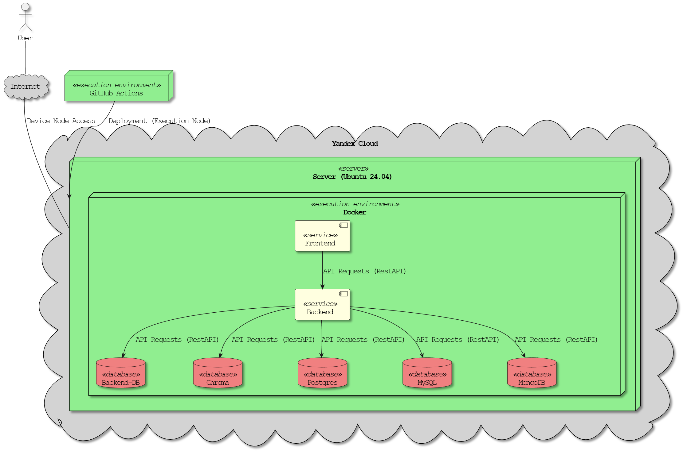

### Deployment view

The project is deployed in Yandex Cloud on an Ubuntu 24.04 server using Docker containers, with GitHub Actions automating the CI/CD process. Customers access the "Frontend" via a web browser over the Internet. For customers to run the project on their own server, they must add their server's username, IP address, and SSH key to GitHub secrets and then trigger the "Deploy Project" workflow. The "Frontend" communicates with the "Backend" via RestAPI, which in turn interacts with "Backend-DB," "Chroma," "Postgres," "MySQL," and "MongoDB," all running securely within Docker on the server.
