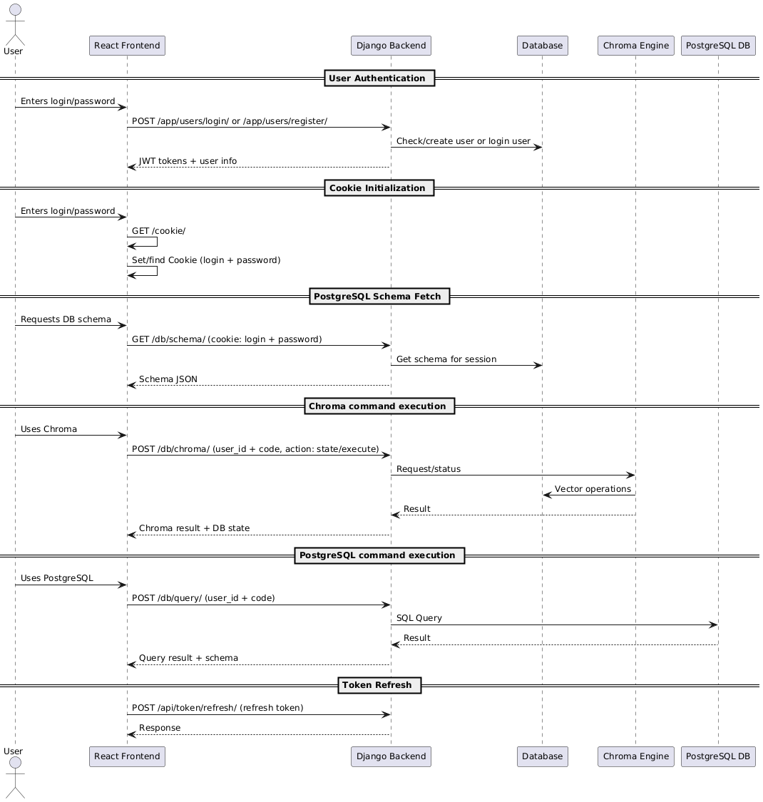

### Dynamic view

All measurements were taken in a production‐like environment (React frontend, Dockerized Django backend, AWS RDS PostgreSQL):

#### Performance Metrics
- **User Authentication:** 120–200 ms
- **Cookie initialization**: 50-60 ms
- **PostgreSQL Schema Fetch:** 150–250 ms
- **Chroma command Execution:** 250–500 ms
- **PostgreSQL command Execution:** 200–400 ms
- **Token refresh:** 10-15 ms
