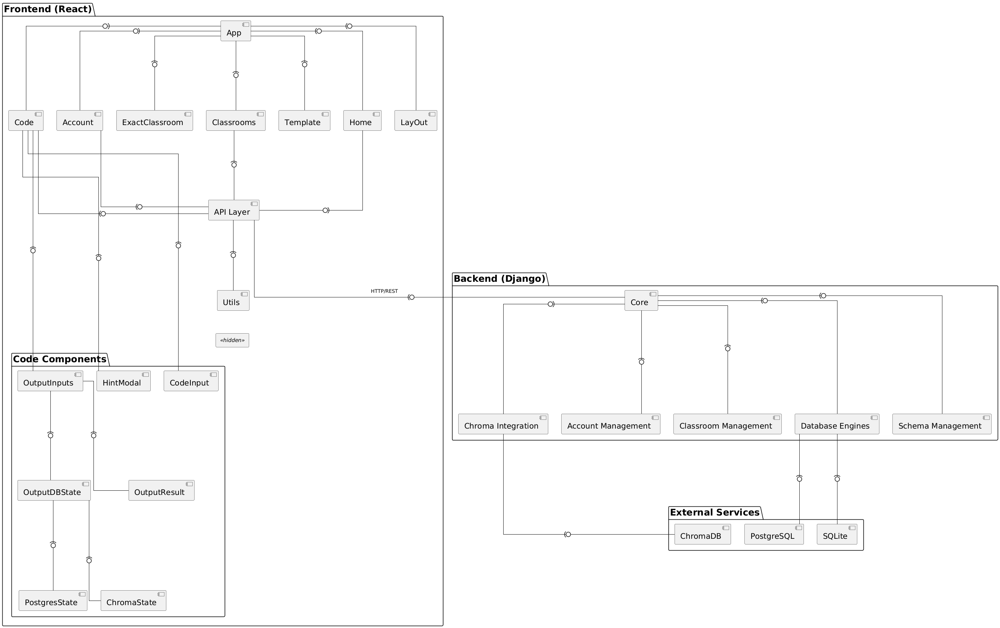

### Static view

Database Playground is an educational platform for interactive database learning, featuring a **React**frontend and **Django** backend. It supports **PostgreSQL**, **ChromaDB**, and **SQLite**, and is deployed via **Docker Compose** with CI/CD automated by **GitHub Actions**.

#### Architectural Layers

The frontend’s App component handles global state and routing, with page modules (Home, Classrooms, ExactClassroom, Account, Template), an interactive Code Editor, and specialized ChromaDB and PostgreSQL UI components. A utility layer provides API clients and helpers. The backend offers REST endpoints in Django, delegates domain logic to service modules (accounts, classrooms, schemas), and uses a Database Engines adapter for multi‑DB support.

#### Deployment Architecture

Docker Compose isolates frontend, backend and databases with environment‑specific configs. A GitHub Actions workflow runs tests (pytest, Django tests) and flake8 linting on main‑branch pushes before deployment.

#### Coupling and Cohesion

Clean REST interfaces and a database adapter pattern ensure loose coupling; containerization further isolates services. High cohesion is achieved by single‑responsibility React components and domain‑focused backend services.

#### Maintainability (ISO 25010)

- **Modularity**  
  Clear layering between frontend, backend, and utility modules; pluggable Database Engines adapters allow individual components to be extended or replaced with minimal ripple effects.

- **Reusability**  
  Centralized API abstraction and utility functions; database‑specific UI components (ChromaState, PostgresState) designed for reuse across multiple views.

- **Analysability**  
  Consistent file/folder structure, clear naming conventions, comprehensive README documentation and quality‑attribute scenarios; CI/CD logs provide transparent build and test reporting.

- **Modifiability**  
  React’s component‑based design localizes UI changes; Django service‑layer abstractions contain backend modifications; Docker Compose configurations isolate environment‑specific adjustments.

- **Testability**  
  Robust backend test suite (pytest + Django TestCase) and automated linting (flake8) integrated into GitHub Actions; each service container can be spun up in isolation for targeted integration tests.
